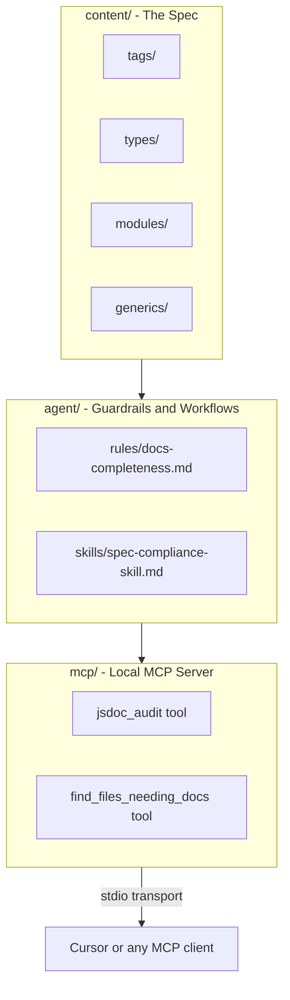

# jsdoc-agent

A specification-first, agent-first system for defining, enforcing, and auditing JSDoc documentation standards. The repo separates concerns into three layers: atomic specs (`content/`), agent guardrails and workflows (`agent/`), and a local MCP server (`mcp/`) that connects those standards to your codebase.

## How it fits together



## Project structure

| Path | Purpose |
| --- | --- |
| [`content/`](content/) | Atomic Markdown specs organized by pillar |
| [`agent/rules/`](agent/rules/) | Hard requirements agents must enforce |
| [`agent/skills/`](agent/skills/) | Step-by-step audit and report workflows |
| [`mcp/`](mcp/) | Node MCP server exposing audit and scan tools |
| [`package.json`](package.json) | Root-level Node dependencies (MCP SDK, zod) |
| [`llms.txt`](llms.txt) | Machine-readable project index for LLM context |

### Content catalog

Specs live under `content/` and are grouped into four pillars:

- **Tags:** [`param-tag`](content/tags/param-tag.md), [`returns-tag`](content/tags/returns-tag.md), [`throws-tag`](content/tags/throws-tag.md), [`typedef-tag`](content/tags/typedef-tag.md), [`example-tag`](content/tags/example-tag.md), [`deprecated-tag`](content/tags/deprecated-tag.md)
- **Types:** [`primitives`](content/types/primitives.md), [`object-shapes`](content/types/object-shapes.md), [`unions-intersections`](content/types/unions-intersections.md)
- **Modules:** [`module-structure`](content/modules/module-structure.md), [`encapsulation`](content/modules/encapsulation.md)
- **Generics:** [`template-standards`](content/generics/template-standards.md)

## How agents use this repo

When assisting with JSDoc, agents should:

1. Load guidance from `content/` for tag, type, module, and generic conventions.
2. Validate against [`agent/rules/docs-completeness.md`](agent/rules/docs-completeness.md) — every public function needs a description, `@param`, `@returns`, and `@throws` where applicable.
3. Follow [`agent/skills/spec-compliance-skill.md`](agent/skills/spec-compliance-skill.md) to produce structured compliance reports.
4. Use the MCP tools below to pull rule sets and scan directories from a connected client.

## MCP server setup

### Install

Clone the repo, then install dependencies from the root (where `package.json` lives):

```bash
npm install
```

### Cursor

Add a stdio MCP server entry to your Cursor config (`.cursor/mcp.json`):

```json
"jsdoc-agent-mcp": {
  "command": "node",
  "args": ["/absolute/path/to/jsdoc-agent/mcp/server.js"]
}
```

Use an absolute path to `mcp/server.js`. Restart Cursor after saving.

### Other MCP clients

Any client that supports stdio MCP can connect the same way — point it at `node /path/to/jsdoc-agent/mcp/server.js`.

## MCP tools

Both tools are implemented in [`mcp/server.js`](mcp/server.js).

| Tool | Input | What it does |
| --- | --- | --- |
| `jsdoc_audit` | `filePath` (absolute) | Reads the target file and [`docs-completeness.md`](agent/rules/docs-completeness.md), then returns a prompt bundle for the connected agent to perform the audit |
| `find_files_needing_docs` | `directory` (absolute or `~/...`) | Recursively scans `.js` and `.ts` files (skips `node_modules`, `.git`) and lists files missing a file-level `/** ... */` header in the first 5 lines |

`jsdoc_audit` delegates reasoning to the connected LLM — it does not parse AST or auto-score compliance on its own.

Example prompts:

- "Audit JSDoc in `/path/to/file.js`"
- "Find files in `~/my-project/src` missing JSDoc headers"

## Development

- Requires Node.js with ESM support (`"type": "module"` in [`package.json`](package.json)).
- Markdown and JS formatting uses [`.prettierrc`](.prettierrc).
- To extend the system: add spec files under `content/`, update rules and skills under `agent/`, and register new tools in [`mcp/server.js`](mcp/server.js).
