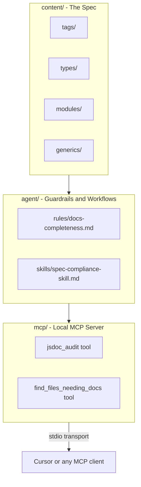

# jsdoc-agent

A specification-first, agent-first system for defining, enforcing, and auditing JSDoc documentation standards. The repo separates concerns into three layers: atomic specs (`content/`), agent guardrails and workflows (`agent/`), and a local MCP server (`mcp/`) that connects those standards to your codebase.

## How it fits together


```mermaid
flowchart TB
  subgraph content [content/ - The Spec]
    tags[tags/]
    types[types/]
    modules[modules/]
    generics[generics/]
  end

  subgraph agent [agent/ - Guardrails and Workflows]
    rules[rules/docs-completeness.md]
    skills[skills/spec-compliance-skill.md]
  end

  subgraph mcp [mcp/ - Local MCP Server]
    audit[jsdoc_audit tool]
    scan[find_files_needing_docs tool]
  end

  content --> agent
  agent --> mcp
  mcp -->|"stdio transport"| client[Cursor or any MCP client]
```

## Project structure

| Path | Purpose |
| --- | --- |
| [`content/`](content/) | Atomic Markdown specs organized by pillar |
| [`agent/rules/`](agent/rules/) | Hard requirements agents must enforce |
| [`agent/skills/`](agent/skills/) | Step-by-step audit and report workflows |
| [`mcp/`](mcp/) | Node MCP server and deterministic audit engine |
| [`mcp/audit/`](mcp/audit/) | AST parsing, completeness rules, and report formatting |
| [`package.json`](package.json) | Root-level Node dependencies (MCP SDK, Babel parser, zod) |
| [`llms.txt`](llms.txt) | Machine-readable project index for LLM context |

### Intentional layout

This repo is a standards and MCP package, not a conventional application. It does not use `app/`, `lib/`, `src/`, or `components/` because those patterns do not fit its purpose. Instead:

| Typical pattern | This repo |
| --- | --- |
| `src/` / `lib/` application code | [`mcp/server.js`](mcp/server.js) + [`mcp/audit/`](mcp/audit/) — MCP glue and deterministic audit engine |
| Domain/business logic | [`content/`](content/) — atomic JSDoc specs |
| Config / policy | [`agent/rules/`](agent/rules/) — hard requirements |
| Workflows / use cases | [`agent/skills/`](agent/skills/) — audit playbooks |
| UI (`app/`, `components/`) | Not applicable — consumed by MCP clients and agents |

### Content catalog

Specs live under `content/` and are grouped into four pillars:

- **Tags:** [`param-tag`](content/tags/param-tag.md), [`returns-tag`](content/tags/returns-tag.md), [`throws-tag`](content/tags/throws-tag.md), [`typedef-tag`](content/tags/typedef-tag.md), [`example-tag`](content/tags/example-tag.md), [`deprecated-tag`](content/tags/deprecated-tag.md)
- **Types:** [`primitives`](content/types/primitives.md), [`object-shapes`](content/types/object-shapes.md), [`unions-intersections`](content/types/unions-intersections.md)
- **Modules:** [`module-structure`](content/modules/module-structure.md), [`encapsulation`](content/modules/encapsulation.md)
- **Generics:** [`template-standards`](content/generics/template-standards.md)

## How agents use this repo

When assisting with JSDoc, agents should:

1. Load guidance from `content/` for tag, type, module, and generic conventions.
2. Validate against [`agent/rules/docs-completeness.md`](agent/rules/docs-completeness.md) for completeness requirements.
3. Follow [`agent/skills/spec-compliance-skill.md`](agent/skills/spec-compliance-skill.md) to produce structured compliance reports.
4. Use the MCP tools below to pull rule sets and scan directories from a connected client.

## MCP server setup

### Install

Clone the repo, then install dependencies from the root (where `package.json` lives):

```bash
npm install
```

### Cursor

Add a stdio MCP server entry to your Cursor config (`.cursor/mcp.json`):

```json
"jsdoc-agent-mcp": {
  "command": "node",
  "args": ["/absolute/path/to/jsdoc-agent/mcp/server.js"]
}
```

Use an absolute path to `mcp/server.js`. Restart Cursor after saving.

### Other MCP clients

Any client that supports stdio MCP can connect the same way — point it at `node /path/to/jsdoc-agent/mcp/server.js`.

## MCP tools

Both tools are registered inline in [`mcp/server.js`](mcp/server.js). There is no separate tool schema directory.

| Tool | Input | What it does |
| --- | --- | --- |
| `jsdoc_audit` | `filePath` (absolute), `suggestFixes` (optional, default `true`) | Parses the file with AST checks, returns a deterministic JSON compliance report and markdown table, and only includes rule/workflow context for LLM fix suggestions when failures exist |
| `find_files_needing_docs` | `directory` (absolute or `~/...`) | Recursively scans `.js` and `.ts` files (skips `node_modules`, `.git`) and lists files missing a described file-level JSDoc block |

`jsdoc_audit` scores compliance deterministically via [`mcp/audit/`](mcp/audit/). The connected LLM is optional and limited to suggesting fixes for symbols already flagged by the engine.

Example `jsdoc_audit` response shape:

```text
--- AUDIT REPORT (JSON) ---
{
  "file": "/path/to/file.js",
  "summary": { "total": 2, "pass": 1, "fail": 1 },
  "results": [
    {
      "symbol": "increment",
      "kind": "function",
      "line": 12,
      "status": "fail",
      "missing": ["Missing @param for \"value\""],
      "ruleIds": ["param-coverage"]
    }
  ]
}

--- COMPLIANCE TABLE ---
| Element | Status | Missing Requirements |
|---------|--------|----------------------|
| increment | Incomplete | Missing @param for "value" |
```

When failures exist and `suggestFixes` is `true`, the tool appends a fix-suggestion context block plus the rule set and audit workflow for the connected agent.

Example prompts:

- "Audit JSDoc in `/path/to/file.js`"
- "Find files in `~/my-project/src` missing JSDoc headers"

## Development

- Requires Node.js with ESM support (`"type": "module"` in [`package.json`](package.json)).
- Run tests with `npm test`.
- Markdown and JS formatting uses [`.prettierrc`](.prettierrc).
- To extend the system: add spec files under `content/`, update rules and skills under `agent/`, and extend [`mcp/audit/`](mcp/audit/) or register new tools in [`mcp/server.js`](mcp/server.js).
