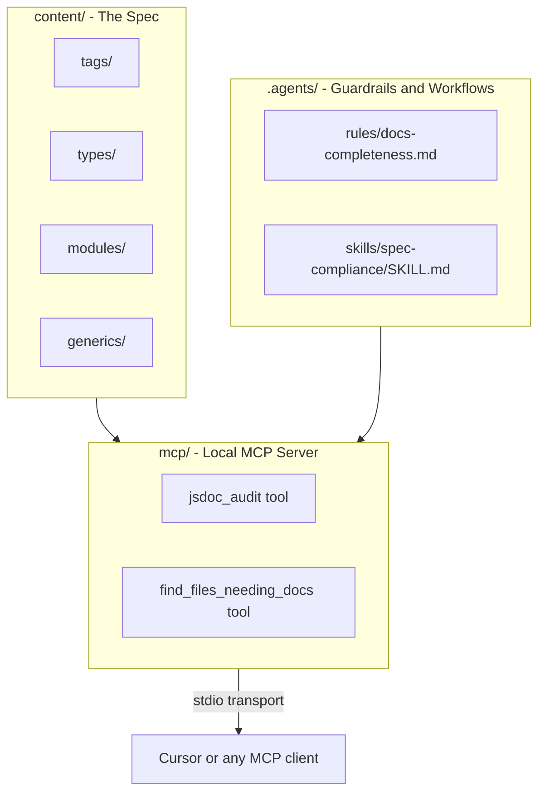

# jsdoc-agent

A specification-first, agent-first system for defining, enforcing, and auditing JSDoc documentation standards. The repo separates concerns into three layers: atomic specs (`content/`), agent guardrails and workflows (`.agents/`), and a local MCP server (`mcp/`) that connects those standards to your codebase.

## How it fits together


```mermaid
flowchart TB
  subgraph content [content/ - The Spec]
    tags[tags/]
    types[types/]
    modules[modules/]
    generics[generics/]
  end

  subgraph agents [.agents/ - Guardrails and Workflows]
    rules[rules/docs-completeness.md]
    skills[skills/spec-compliance/SKILL.md]
  end

  subgraph mcp [mcp/ - Local MCP Server]
    audit[jsdoc_audit tool]
    scan[find_files_needing_docs tool]
  end

  content --> mcp
  agents --> mcp
  mcp -->|"stdio transport"| client[Cursor or any MCP client]
```

## Project structure

| Path | Purpose |
| --- | --- |
| [`content/`](content/) | Atomic Markdown specs organized by pillar |
| [`.agents/rules/`](.agents/rules/) | Hard requirements agents must enforce |
| [`.agents/skills/`](.agents/skills/) | Audit and development agent workflows |
| [`mcp/`](mcp/) | Node MCP server exposing audit and scan tools |
| [`package.json`](package.json) | Root-level Node dependencies (MCP SDK, zod) |
| [`llms.txt`](llms.txt) | Machine-readable project index for LLM context |

### Intentional layout

This repo is a standards and MCP package, not a conventional application. It does not use `app/`, `lib/`, `src/`, or `components/` because those patterns do not fit its purpose. Instead:

| Typical pattern | This repo |
| --- | --- |
| `src/` / `lib/` application code | [`mcp/server.js`](mcp/server.js) — thin runtime glue only |
| Domain/business logic | [`content/`](content/) — atomic JSDoc specs |
| Config / policy | [`.agents/rules/`](.agents/rules/) — hard requirements |
| Workflows / use cases | [`.agents/skills/`](.agents/skills/) — audit playbooks |
| UI (`app/`, `components/`) | Not applicable — consumed by MCP clients and agents |

### Content catalog

Specs live under `content/` and are grouped into four pillars:

- **Tags:** [`param-tag`](content/tags/param-tag.md), [`returns-tag`](content/tags/returns-tag.md), [`throws-tag`](content/tags/throws-tag.md), [`typedef-tag`](content/tags/typedef-tag.md), [`example-tag`](content/tags/example-tag.md), [`deprecated-tag`](content/tags/deprecated-tag.md)
- **Types:** [`primitives`](content/types/primitives.md), [`object-shapes`](content/types/object-shapes.md), [`unions-intersections`](content/types/unions-intersections.md)
- **Modules:** [`module-structure`](content/modules/module-structure.md), [`encapsulation`](content/modules/encapsulation.md)
- **Generics:** [`template-standards`](content/generics/template-standards.md)

## How agents use this repo

When assisting with JSDoc, agents should:

1. Use MCP `jsdoc_audit`, which bundles `content/` specs, rules, and workflow at runtime.
2. Validate against [`.agents/rules/docs-completeness.md`](.agents/rules/docs-completeness.md) for completeness requirements.
3. Follow [`.agents/skills/spec-compliance/SKILL.md`](.agents/skills/spec-compliance/SKILL.md) to present the structural audit and suggest fixes.
4. Use `find_files_needing_docs` to scan directories for missing file-level headers.

## MCP server setup

### Install

Clone the repo, then install dependencies from the root (where `package.json` lives):

```bash
npm install
```

### Cursor

Add a stdio MCP server entry to your Cursor config (`.cursor/mcp.json`):

```json
"jsdoc-agent-mcp": {
  "command": "node",
  "args": ["/absolute/path/to/jsdoc-agent/mcp/server.js"]
}
```

Use an absolute path to `mcp/server.js`. Restart Cursor after saving.

### Other MCP clients

Any client that supports stdio MCP can connect the same way — point it at `node /path/to/jsdoc-agent/mcp/server.js`.

## MCP tools

Both tools are registered inline in [`mcp/server.js`](mcp/server.js). There is no separate tool schema directory.

| Tool | Input | What it does |
| --- | --- | --- |
| `jsdoc_audit` | `filePath` (absolute) | Runs AST extraction and deterministic structural scoring, then returns a layered response: structural audit table, [`.agents/rules/docs-completeness.md`](.agents/rules/docs-completeness.md), all 12 [`content/`](content/) specs, [`.agents/skills/spec-compliance/SKILL.md`](.agents/skills/spec-compliance/SKILL.md), and the target source |
| `find_files_needing_docs` | `directory` (absolute or `~/...`) | Recursively scans `.js` and `.ts` files (skips `node_modules`, `.git`) and lists files missing a file-level JSDoc description in the first 3 top-level AST statements |

`jsdoc_audit` output sections (in order):

1. `--- STRUCTURAL AUDIT ---` — deterministic pass/fail table
2. `--- RULE SET ---`
3. `--- CONTENT SPECS ---`
4. `--- AUDIT WORKFLOW ---`
5. `--- TARGET CODE ---`

Example prompts:

- "Audit JSDoc in `/path/to/file.js`"
- "Find files in `~/my-project/src` missing JSDoc headers"

## Development

- Requires Node.js with ESM support (`"type": "module"` in [`package.json`](package.json)).
- Run tests with `npm test`.
- Markdown and JS formatting uses [`.prettierrc`](.prettierrc).
- To extend the system: add spec files under `content/`, update rules and skills under `.agents/`, and register new tools in [`mcp/server.js`](mcp/server.js).
